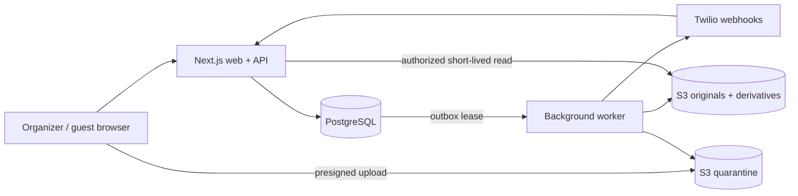

# NearGather Engineering Source of Truth

## Status

- Architecture version: `0.1.0`
- Date: 2026-08-19
- Owner: NearGather Architecture + State Engine
- Implementation plan: `2026-08-19-neargather-architecture-state-engine-plan.md`

## Runtime boundary

NearGather is a modular TypeScript monolith with a Next.js web/API process and a background worker from the same workspace. PostgreSQL is canonical. S3, Twilio, and Clerk are replaceable adapters. The worker consumes a PostgreSQL transactional outbox; there is no external message broker.

## Workspace ownership

| Workspace | Owns | May depend on |
| --- | --- | --- |
| `apps/web` | HTTP routes, Next.js UI, webhook normalization | domain, contracts, db, providers |
| `apps/worker` | outbox consumption and asynchronous orchestration | domain, contracts, db, providers |
| `packages/domain` | policy, state transitions, next-step resolution | contracts only |
| `packages/contracts` | command, event, and provider-port types | no NearGather package |
| `packages/db` | schema, migrations, transactions, RLS, audit, outbox | contracts and domain |
| `packages/providers` | Clerk, Twilio, and S3 adapter implementations | contracts only |
| `packages/testing` | fixtures, fakes, and integration helpers | contracts only until a test requires more |

Apps are composition roots and no package may import from an app. Domain code never imports database or provider adapters. The dependency directions make the same state-engine semantics reusable across web, SMS, and QR channels.

## Configuration authority

- `.node-version`, `package.json`, and `.npmrc` pin the local runtime to Node.js 24 and pnpm 11.
- `apps/web` declares Next.js `16.2.11` exactly; deployables may not silently upgrade it.
- `.env.example` is the complete local environment-variable inventory and contains placeholders only.
- `render.yaml` is a secret-free deployment skeleton; managed secret values are supplied outside the repository.

## Domain authority

Only `packages/domain` may decide RSVP transitions, contribution acceptance, question progress, or opt-out effects. Adapters authenticate and normalize input, then invoke domain commands.

## Event and participation rules

- `Event.type` includes `WEDDING`, `BABY_SHOWER`, and `BIRTHDAY`; birthday formats are `STANDARD`, `MILESTONE`, and `SHARED` and affect configuration/copy only.
- Honorees are event-local subjects, not actors. Minor honorees never receive accounts, contacts, RSVPs, contributions, uploads, or messaging threads.
- Every organizer, respondent, contributor, and uploader requires versioned `AdultActorAssurance` before collection.
- Minor-present events require `GuardianAuthorityRecord` and adult-on-behalf-of-child `OnBehalfDisclosureReceipt` before collection.
- Processing notices, optional consent, media licenses, SMS suppression, and data-rights requests are separate records.
- Imported phones are matching evidence only; SMS is guest-initiated.

## Identity and RSVP rules

- `Party` is the event-scoped household/group aggregate.
- `Invitation` is the revocable access artifact for one party.
- A unique event phone or invitation capability resolves a party, never a global person.
- One accepted required-prompt contribution satisfies the party gate.
- Attendance and logistics remain guest-level.
- `STOP` changes messaging consent only; `NO` changes RSVP only in a resolved RSVP context.
- `ATTENDING_*` requires an accepted qualifying contribution; `EXEMPT_*` requires an explicit audited organizer exemption.
- No pending media asset can qualify an RSVP.

## Privacy boundary

The guestbook is an organizer-only projection of accepted, visible contributions. It is structurally incapable of selecting question answers, contacts, messaging consent, or invitation tokens.

## Runtime flow

