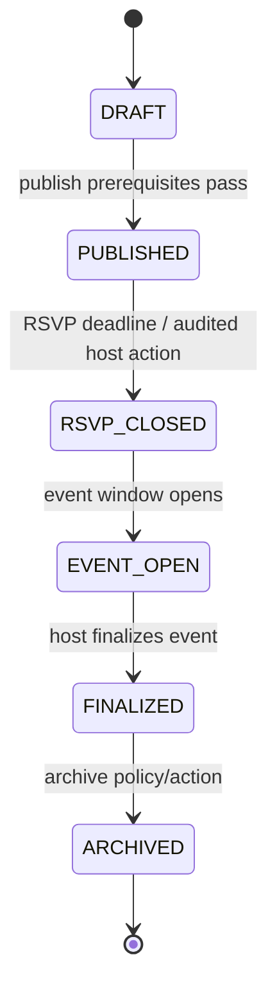
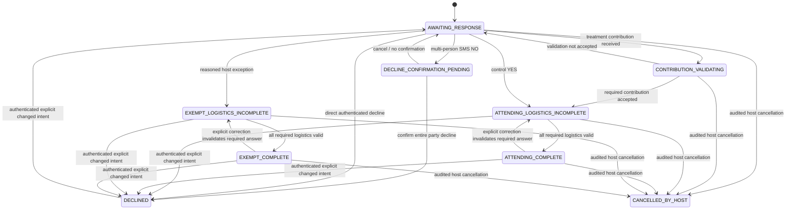
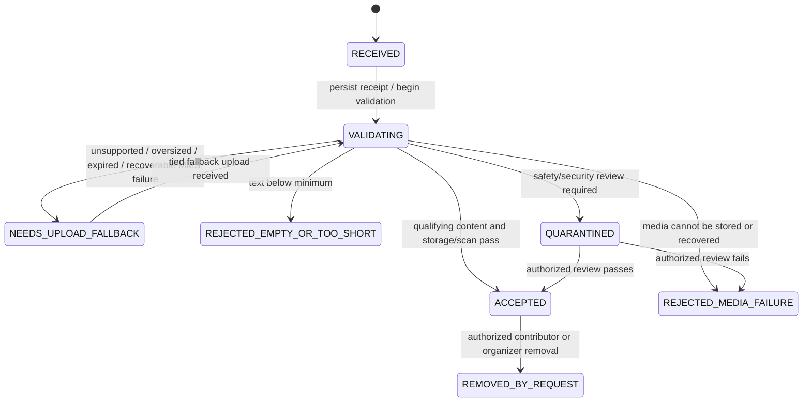
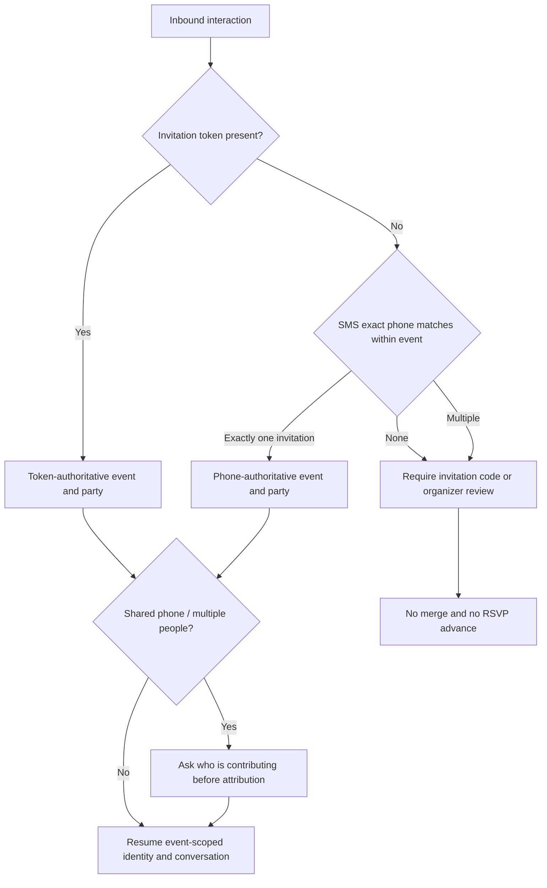

# Canonical Model and States

| Field | Value |
|---|---|
| Document owner | Chat 1 Product Command Center |
| Status | Approved baseline |
| Version | 2.0.0 |
| Last updated | 2026-08-19 |

This dictionary is normative for P0. Implementations may add internal fields, but may not alter the meaning, authority, or transition rules here without [change control](governance.md#change-control-process).

## Canonical terms and entities

| Entity | Definition | Required P0 contract |
|---|---|---|
| `Event` | One wedding, baby shower, or adult-managed birthday with lifecycle, configuration, prompts, access rules, and experiment assignment | Event ID; `EventType`; nullable `BirthdayFormat`; U.S. locale; dates/deadlines; lifecycle; host/cohost authorization; required logistics; assignment; retention/deletion status |
| `HonoreeProfile` | Event-scoped honoree descriptor that is not a guest identity, user account, contact, or messaging recipient | Profile ID; event ID; adult-safe display label; `ageBand` of `ADULT` or `MINOR`; no phone, login, account, verified channel, or cross-event identity linkage |
| `AdultActorAssurance` | Versioned 18+ attestation collected before any organizer, respondent, contributor, or uploader enters a data-collection flow | Assurance ID; event ID; adult actor ID/role; copy version; attested time; source channel; audit reference |
| `GuardianAuthorityRecord` | Adult guardian's event-scoped attestation of authority for a birthday with a minor honoree | Record ID; event ID; guardian adult actor ID; authority basis/category; copy version; attested time; audit reference; no child phone/account/contact data |
| `OnBehalfDisclosureReceipt` | Receipt proving an adult saw and acknowledged that child-related content is submitted on the adult's behalf and responsibility | Receipt ID; event/adult actor/honoree profile IDs; copy version; acknowledged time; channel; contribution correlation; audit reference |
| `Invitation` | Access artifact and token sent to one invited party; not an RSVP | Invitation ID; event ID; party ID; primary contact; token(s); delivery state; active routes; publish snapshot |
| `Party` | Household/group represented by one invitation and one required contribution | Party ID; invited members; plus-one rules; primary contact; eligibility; guest-list origin |
| `GuestIdentity` | Event-scoped person/contact with verified channels and consent records | Identity ID; event ID; guest-list origin; verified channels; party association(s); attribution name; consent references |
| `RSVP` | Attendance and logistics state for an invitation party and its members | RSVP ID; party ID; canonical state; member attendance; required answers; gate status; exception reference; version; audit references |
| `Contribution` | Response to a prompt, stored independently from RSVP | Contribution ID; event/party/identity/prompt IDs; lifecycle; channel; media type; timestamps; asset/text; attribution; deletion state |
| `Prompt` | Required RSVP prompt, event prompt, or post-event control prompt | Prompt ID; event ID; type; configured text; active state; publish snapshot |
| `PromptRoute` | QR/link routing metadata for one prompt | Route ID; prompt/event IDs; route token; enabled flag; experiment exclusion; access policy |
| `InboundMessage` | Immutable SMS/MMS provider event used for idempotent processing | Inbound ID; provider message ID; destination event number; raw receipt; received time; processing status; dedupe key |
| `ConversationSession` | Current channel, identity, party, and expected logistics question | Session ID; event/party/identity; channel; expected question; resume cursor; version; updated time |
| `MediaAsset` | Original upload, processing state, access policy, and deletion state | Asset ID; contribution ID; original object; duration/type/size; storage result; scan state; signed-access policy; deletion tombstone |
| `ConsentRecord` | What was agreed to, by whom, for which contribution and event | Consent ID; event/identity/contribution; copy version; purpose; channel; timestamp; opt-out or withdrawal status |
| `ExperimentAssignment` | Treatment/control arm and matched-pair identifier | Assignment ID; event ID; arm; matched-pair ID; assigned by/at; immutable-on-publication evidence |
| `AuditEntry` | Immutable record of organizer or guest intent and resulting state/data change | Audit ID; actor; event; target; prior/new values or states; reason; source channel; timestamp; correlation ID |

## Enumerations

The following TypeScript-shaped contracts are normative interface definitions for the birthday/minor policy. They are representation-neutral; implementations must preserve the required nullability, event scope, and sequencing.

```ts
type EventType = "WEDDING" | "BABY_SHOWER" | "BIRTHDAY";
type BirthdayFormat = "STANDARD" | "MILESTONE" | "SHARED";
type HonoreeAgeBand = "ADULT" | "MINOR";

type HonoreeProfile = {
  eventId: string;
  displayName: string;
  ageBand: HonoreeAgeBand;
  guestIdentityId: null;
  phone: null;
  accountId: null;
};

type AdultActorAssurance = {
  eventId: string;
  actorId: string;
  role: "ORGANIZER" | "COHOST" | "RSVP_RESPONDENT" | "CONTRIBUTOR" | "UPLOADER";
  attested18Plus: true;
  noticeVersion: string;
  attestedAt: string;
};

type GuardianAuthorityRecord = {
  eventId: string;
  minorHonoreeId: string;
  guardianAdultActorId: string;
  authorityScope: "EVENT_AND_PRIVATE_GUESTBOOK";
  noticeVersion: string;
  recordedAt: string;
};

type OnBehalfDisclosureReceipt = {
  eventId: string;
  adultActorId: string;
  minorHonoreeId: string;
  disclosureVersion: string;
  acknowledgedAt: string;
};
```

| Concept | Allowed P0 values |
|---|---|
| `EventType` | `WEDDING`, `BABY_SHOWER`, `BIRTHDAY` |
| `BirthdayFormat` | `STANDARD`, `MILESTONE`, `SHARED` |
| `HonoreeProfile.ageBand` | `ADULT`, `MINOR` |
| Experiment arm | `TREATMENT`, `CONTROL` |
| Prompt type | `REQUIRED_RSVP`, `EVENT_PROMPT`, `POST_EVENT_CONTROL` |
| Channel | `WEB`, `QR_WEB`, `SMS`, `MMS`, `FALLBACK_UPLOAD`, `ORGANIZER` |
| Media type | `TEXT`, `AUDIO`, `VIDEO` |
| Guest-list origin | `INVITED`, `UNINVITED_EVENT_ATTENDEE` |
| Gate status | `NOT_APPLICABLE_CONTROL`, `UNSATISFIED`, `SATISFIED_BY_CONTRIBUTION`, `SATISFIED_BY_HOST_EXCEPTION` |
| Logistics status | `NOT_OPEN`, `INCOMPLETE`, `COMPLETE` |
| Identity resolution | `TOKEN_AUTHORITATIVE`, `PHONE_AUTHORITATIVE`, `CODE_REQUIRED`, `ORGANIZER_REVIEW_REQUIRED`, `NEW_UNINVITED_IDENTITY` |

## Event lifecycle



| State | Meaning | Edit rule |
|---|---|---|
| `DRAFT` | Configuration is not live | Freely editable within P0 eligibility |
| `PUBLISHED` | Invitations/routes and assignment snapshot are live | Prompt, assignment, and required-logistics changes require audited organizer action; assignment itself cannot change |
| `RSVP_CLOSED` | Standard RSVP collection window closed | Audited corrections and documented exception handling only |
| `EVENT_OPEN` | Event-time contribution window is active | RSVP and prompt-route rules remain separate |
| `FINALIZED` | Host has ended active event operations | Export, deletion, and retention rights continue |
| `ARCHIVED` | Event is no longer active in normal operations | Not deleted; 12-month guarantee and deletion obligations continue |

### Event invariants

- `EVT-INV-001`: Lifecycle advances in the displayed order; deletion is a separate policy action, not a lifecycle state.
- `EVT-INV-002`: Only `DRAFT` is freely editable.
- `EVT-INV-003`: `ExperimentAssignment.arm` and `matchedPairId` are immutable once `PUBLISHED` is entered.
- `EVT-INV-004`: An audited post-publication prompt or required-logistics edit preserves the original publish snapshot.
- `EVT-INV-005`: `ARCHIVED` never implies deletion or release from retention/deletion obligations.
- `EVT-INV-006`: `birthdayFormat` and at least one `HonoreeProfile` are required when type is `BIRTHDAY` and absent for other event types.
- `EVT-INV-007`: A `MINOR` honoree is never a `GuestIdentity`, invitation primary contact, messaging recipient, account holder, respondent, contributor, or uploader.
- `EVT-INV-008`: Every organizer, respondent, contributor, and uploader must have a current `AdultActorAssurance` before collection; a minor-honoree birthday additionally requires a `GuardianAuthorityRecord`, and child-related submission additionally requires a prior `OnBehalfDisclosureReceipt`.
- `EVT-INV-009`: Wedding, baby-shower, adult-birthday, minor-honoree, milestone, and shared-birthday journeys use the unchanged RSVP, contribution, and conversation lifecycles below.

## RSVP lifecycle



### RSVP transition invariants

- `RSVP-INV-001`: Treatment enters `ATTENDING_LOGISTICS_INCOMPLETE` only from acceptance of an `ACCEPTED` contribution to the `REQUIRED_RSVP` prompt.
- `RSVP-INV-002`: Treatment enters an `EXEMPT_*` state only through an authenticated organizer/cohost action with a non-empty reason.
- `RSVP-INV-003`: Control may enter `ATTENDING_LOGISTICS_INCOMPLETE` through conventional affirmative intent without a contribution.
- `RSVP-INV-004`: `ATTENDING_*` and `EXEMPT_*` confirm attendance; only `*_COMPLETE` means all required logistics are valid.
- `RSVP-INV-005`: `STOP`, `HELP`, an event-prompt contribution, a post-event contribution, failed media, and a fallback-link issue do not change attendance.
- `RSVP-INV-006`: Multi-person SMS `NO` cannot enter `DECLINED` before explicit whole-party confirmation. Web authenticated decline may enter it directly.
- `RSVP-INV-007`: A reversal requires explicit new guest or organizer intent and an `AuditEntry`.
- `RSVP-INV-008`: A later decline does not remove an existing contribution or media asset.
- `RSVP-INV-009`: Manual attendance override outside `SATISFIED_BY_HOST_EXCEPTION` is invalid.
- `RSVP-INV-010`: Gate status, attendance state, and logistics status are stored and reported separately.

## Contribution lifecycle



### Contribution transition invariants

- `CONTRIB-INV-001`: Receipt is persisted before processing; `RECEIVED` is never synthesized only after validation.
- `CONTRIB-INV-002`: Qualifying text contains at least 10 non-whitespace characters.
- `CONTRIB-INV-003`: Qualifying audio/video is at least 3 seconds and successfully stored; media duration without successful storage cannot be `ACCEPTED`.
- `CONTRIB-INV-004`: Only an `ACCEPTED` contribution for `REQUIRED_RSVP` can satisfy the treatment gate.
- `CONTRIB-INV-005`: Fallback upload preserves original prompt, identity, party, and conversation correlation.
- `CONTRIB-INV-006`: Removal changes the contribution to `REMOVED_BY_REQUEST` and propagates access/deletion policy; it does not silently rewrite RSVP history.
- `CONTRIB-INV-007`: Later simultaneous accepted responses remain separate guestbook entries, even when only the first advances the gate.

## Identity resolution and continuity



### Identity invariants

1. `ID-INV-001`: Valid invitation token wins for web and QR resolution.
2. `ID-INV-002`: Only an exact phone match unique to one invitation in the event is authoritative for SMS.
3. `ID-INV-003`: No match or multiple matches never causes automatic, fuzzy, name-only, or cross-event merge.
4. `ID-INV-004`: Shared phones remain party-scoped until contributor attribution is explicitly collected.
5. `ID-INV-005`: Authenticated channel switching resumes the existing RSVP and expected logistics question.
6. `ID-INV-006`: Event-prompt identity resolution and creation of an uninvited event-scoped identity never mutate RSVP.
7. `ID-INV-007`: P0 identity and consent remain scoped to a single event; no NearYou or global graph is populated.
8. `ID-INV-008`: An imported phone number may be used only for event-scoped identity matching; import creates neither SMS consent nor marketing consent, and messaging requires a separately valid consent/legal basis and approved channel behavior.
9. `ID-INV-009`: A minor honoree cannot be resolved or created as a `GuestIdentity`, including from an imported row, shared phone, invitation token, or organizer review.

## Idempotency and concurrency invariants

- `IDEM-INV-001`: SMS/MMS dedupe key is `(providerMessageId, destinationEventNumber)`.
- `IDEM-INV-002`: Reprocessing the same dedupe key yields the same contribution/response outcome and no second state advance.
- `IDEM-INV-003`: Web submissions use an idempotency key bound to event, invitation/party, prompt, and submission intent.
- `IDEM-INV-004`: RSVP transition applies against a version or equivalent atomic guard; only one competing response can perform the first gate advance.
- `IDEM-INV-005`: Duplicate or out-of-order provider events cannot skip the expected logistics question.
- `IDEM-INV-006`: Concurrent valid submissions after the first accepted required contribution may create distinct guestbook contributions but cannot create another RSVP or repeat attendance confirmation.
- `IDEM-INV-007`: Inbound event raw receipt and processing outcome remain auditable even when deduplicated.

## Display and telemetry semantics

| Fact | True when | Required wording/usage |
|---|---|---|
| Accepted contribution | Contribution is `ACCEPTED` | May enter guestbook; only required-prompt treatment contribution satisfies gate |
| Attendance confirmed | RSVP is `ATTENDING_*` or `EXEMPT_*` | May say attendance confirmed; preserve whether contribution or exception caused it |
| RSVP complete | RSVP is `ATTENDING_COMPLETE` or `EXEMPT_COMPLETE` | Only then may say `Your RSVP is complete.` |
| Declined | RSVP is `DECLINED` | Not equivalent to messaging opt-out |
| Messaging opt-out | Consent/messaging record reflects `STOP` | Must not be interpreted as declined |

See [acceptance criteria](journeys-and-acceptance.md) and the [metric dictionary](experiment-and-metrics.md) for observable evidence derived from these states.
