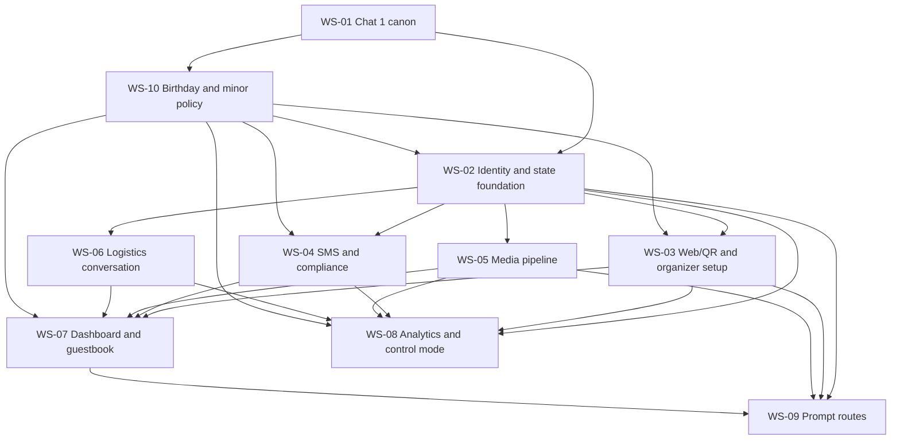

# Dependency and Workstream Handoff Register

| Field | Value |
|---|---|
| Document owner | Chat 1 Product Command Center |
| Status | Approved baseline |
| Version | 2.0.0 |
| Last updated | 2026-08-19 |

This register defines product contracts and evidence boundaries, not code tasks or solution architecture. All work consumes the [canonical model](canonical-model-and-states.md) and follows [change control](governance.md).

## Dependency order



## Workstream contracts

| Workstream | Canonical inputs | Required outputs and states | Telemetry | Privacy/compliance constraints | Upstream | Acceptance evidence | Status |
|---|---|---|---|---|---|---|---|
| WS-01 Chat 1 canon | Approved plan and rollout strategy | Versioned PRD, ledger, dictionary, acceptance matrix, experiment, handoffs, decisions, releases, IP register | Measurement vocabulary | Confidential IP/disclosure controls | None | Package review and link/ID validation | Approved baseline |
| WS-02 Identity/state foundation | P0-EVT-001, P0-BDAY-001, P0-ID-001, P0-GATE-001; all invariants | Event, honoree policy records, invitation, party, adult identity, RSVP, contribution, consent, audit, assignment contracts; atomic transitions | State changes, identity resolution, adult assurance, guardian authority, on-behalf disclosure, assignment audit | Event scope; no child identity/contact/account; no fuzzy/cross-event merge; immutable assignment; consent links | WS-01, WS-10 | EVD-STATE-001, EVD-DATA-001, EVD-IDEM-001, EVD-POL-001 | Not started |
| WS-03 Web/QR and organizer setup | P0-EVT-001, P0-BDAY-001, P0-GATE-001, P0-EXC-001 | Publish flow, birthday format/age-band configuration, adult and guardian gates, token authority, treatment gate, direct decline, exception interface, review/correction | Invite open, RSVP start, policy receipts, gate, contribution, decline, exception, completion | Host authorization, 18+ actors, no child identity, no self-skip, accessible gate/exception path | WS-02, WS-10 | AC-PUB-001–006, AC-BDAY-001–008, AC-WEB-001–006, AC-DEC-001, AC-DEC-004, AC-EXC-001–003 | Not started |
| WS-04 SMS/compliance | P0-BDAY-001, P0-ID-001, P0-EXC-001, P0-MSG-001 | Event-number binding, exact adult-phone resolution, STOP/HELP, party decline confirmation, persist/dedupe, fallback response | Message receipt/outcome, gate, decline, opt-out, support, switch, assurance/disclosure outcomes | U.S. A2P registration; approved consent/help copy; imported phone is identity-only and no consent; no child recipient; no STOP-as-decline | WS-02, WS-10; consent copy; messaging registration | AC-SMS-001–007, AC-BDAY-002–007, AC-DEC-002–003; EVD-IDEM-001 | Not started |
| WS-05 Media pipeline | P0-MSG-001, P0-BOOK-001; contribution states | Private originals, validation, duration, scanning/quarantine, signed access, fallback attachment, deletion | Attempt, accept/fail, type, fallback, removal | Private non-indexed storage; expiring access; 12-month guarantee; deletion propagation | WS-02 | AC-WEB-002, AC-SMS-006, AC-GBK-002–006; EVD-PRIV-001 | Not started |
| WS-06 Logistics conversation | P0-LOG-001 and RSVP states | Applicability engine, member/party answers, review/correction, resumable expected question, completion validation | Question progress, completion, switch, organizer intervention | Collect only configured/applicable data; audit changes; access control | WS-02 | AC-WEB-003–004, AC-SMS-004, AC-CTL-001–002 | Not started |
| WS-07 Dashboard/guestbook | P0-BOOK-001, P0-OPS-001; outputs from WS-03–06 | Separate invitation/attendance/gate/logistics/contribution/channel/exception/delivery views; queues; exports; removal | Review queue, export, deletion, operational outcomes | Host/cohost-only all-entry access; least privilege; signed URLs; reason restriction | WS-03, WS-04, WS-05, WS-06 | AC-WEB-006, AC-EXC-003, AC-GBK-001–006; EVD-OPS-001 | Not started |
| WS-08 Analytics/control | P0-CTRL-001, P0-BDAY-001, P0-MEAS-001; stable schemas | Internal flag, conventional RSVP, immutable pair assignment, 15-pair metric queries, operational/research dashboards | Full frozen telemetry dictionary including event type, birthday format, honoree age band, and policy-record presence | Arm hidden from public; no child identifiers/content in analytics; payload minimization; adjusted/unadjusted reporting | WS-02–WS-06, WS-10 | AC-CTL-001–005, AC-BDAY-008, AC-EXC-004; EVD-TELEM-001, EVD-POL-001 | Not started |
| WS-09 Prompt routes | P0-ROUTE-001 | Five to ten exact routes, identity before submit, uninvited labels, guestbook entry, zero RSVP mutation | Route open, identity outcome, contribution outcome | Disabled in matched experiment; same private media/auth; no physical fulfillment | WS-02, WS-03, WS-05, WS-07 | AC-PUB-005, AC-PRM-001–006 | Not started |
| WS-10 Birthday and minor policy | P0-BDAY-001; DEC-030–DEC-037 | Birthday format/age-band policy, 18+ assurance, guardian authority, on-behalf disclosure, fixtures, and negative-path contract | Policy prompt/display/acknowledgment outcomes and safe birthday dimensions | No child identity/phone/account; no imported-phone consent; host-only media; no marketing, cross-product use, or AI | WS-01; approved policy/copy | AC-BDAY-001–008; EVD-POL-001, EVD-PRIV-001 | Not started |

## Handoff register

| Handoff ID | From | To | Contract scope | Owner | Status | Evidence |
|---|---|---|---|---|---|---|
| HND-001 | WS-01 | WS-02 | Canonical entities, lifecycles, invariants, audit and assignment | Not assigned | Not started | No evidence recorded |
| HND-002 | WS-02 | WS-03 | Token authority, party/RSVP transition interface, publish snapshot | Not assigned | Not started | No evidence recorded |
| HND-003 | WS-02 | WS-04 | Event-number/phone resolution, inbound idempotency, consent linkage | Not assigned | Not started | No evidence recorded |
| HND-004 | WS-02 | WS-05 | Contribution/media lifecycle, identity/prompt correlation, removal | Not assigned | Not started | No evidence recorded |
| HND-005 | WS-02 | WS-06 | RSVP transition and party/member applicability contracts | Not assigned | Not started | No evidence recorded |
| HND-006 | WS-03–06 | WS-07 | Separate RSVP/contribution/logistics/exception/media operational projections | Not assigned | Not started | No evidence recorded |
| HND-007 | WS-02–06 | WS-08 | Stable schemas, event contracts, assignment, telemetry payloads | Not assigned | Not started | No evidence recorded |
| HND-008 | WS-02/03/05/07 | WS-09 | Prompt routing, identity, media, guestbook, no-RSVP-mutation contract | Not assigned | Not started | No evidence recorded |
| HND-009 | WS-01 | WS-10 | Birthday/minor policy canon, adult-role scope, thesis-pilot fixtures, and downstream boundary | Not assigned | Not started | `CHG-2026-004`; received Chat 2, Chat 8, and Chat 9 delegation evidence |
| HND-010 | WS-10 | WS-02/03/04/07/08 | Enforceable adult assurance, guardian authority, on-behalf disclosure, no-child-identity, consent, telemetry, and evidence contracts | Not assigned | Not started | No evidence recorded |

## Reusable downstream handoff template

Copy this section into the receiving workstream artifact. Do not omit fields; use the explicit status vocabulary when evidence or ownership is absent.

```markdown
# NearGather Downstream Handoff

| Field | Value |
|---|---|
| Handoff ID | HND-YYYY-NNN |
| Product-command-center version | 2.0.0 |
| From / to workstream | Not assigned |
| Accountable owner | Not assigned |
| Status | Not started |
| Last updated | 2026-08-19 |

## Applicable canon

- PRD requirement IDs: Not started
- Acceptance IDs: Not started
- Decision IDs: Not started
- Metric/telemetry IDs: Not started
- Event type and, when `BIRTHDAY`, `BirthdayFormat` and honoree `ageBand`: Not started

## Contract

- Inputs consumed: Not started
- Outputs produced: Not started
- Canonical entities/states/invariants consumed: Not started
- Birthday/minor policy records consumed (`AdultActorAssurance`, `GuardianAuthorityRecord`, `OnBehalfDisclosureReceipt`): Not started
- Allowed transitions and prohibited side effects: Not started
- Idempotency/concurrency behavior: Not started

## Telemetry emitted

- Event names, trigger points, required context, and dedupe behavior: Not started

## Privacy, consent, security, and compliance constraints

- Data scope, authorization, retention/deletion, content minimization, messaging, and disclosure constraints: Not started
- 18+ role enforcement and proof that no minor honoree receives identity, phone, account, direct messaging, response, contribution, upload, purchase, or prize-recipient state: Not started
- Imported-phone rule: identity matching only; no SMS or marketing consent is created: Not started
- Birthday/minor policy copy versions, sequencing, guardian-authority basis, and on-behalf disclosure timing: Not started
- Host-only media, signed access, audited removal, export/deletion, 12-month retention, U.S.-only, no marketing/cross-product/AI: Not started

## Dependencies

- Upstream artifacts/services/approvals: Not started
- Downstream consumers: Not started
- Feature flags and release-gate dependencies: Not started

## Acceptance evidence

- Test/scenario evidence by acceptance ID: No evidence recorded
- Authorization/privacy evidence: No evidence recorded
- Telemetry/query evidence: No evidence recorded
- Birthday fixtures and negative-path policy evidence by `AC-BDAY-*`: No evidence recorded
- Known deviations: No evidence recorded

## Proposed scope or behavior changes

- Change proposal IDs: No evidence recorded
- Canonical status: Not started
- Work on changed behavior remains blocked until Chat 1 decision: Yes
```

## Handoff acceptance rule

A handoff is accepted only when all applicable IDs are cited, interfaces preserve canonical meaning, evidence covers positive and negative paths, telemetry is queryable, privacy/compliance constraints are met, and proposed behavior changes have an approved [decision](decision-log.md). `No evidence recorded` cannot satisfy a release gate.
